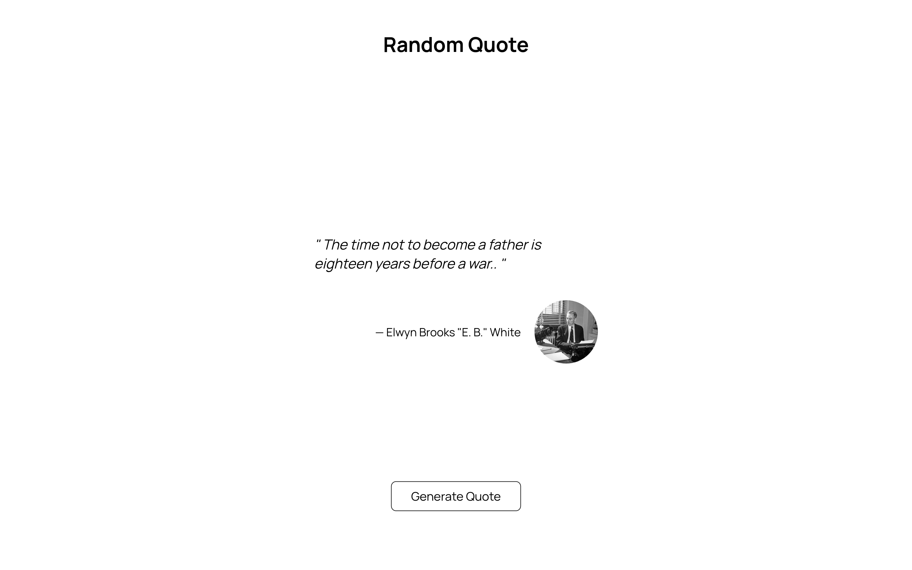

# Table of Contents
- [Introduction](#random-quote-app)
- [Implementation Details](#implementation-details)
- [What I've Learned](#what-ive-learned)
# Random quote app
A web page that displays random quotes. Built with SASS, JS and HTML. This project was done as part of my training as a junior web developer at BeCode.

# Implementation Details
The quotes originate from the [thatsthespir.it](https://thatsthespir.it) api, they are pulled from the api with `fetch` inside an `async` fucntion called `getQuote`:
```javascript
async function getQuote(){
    /* ... */
    const quoteResponse = await fetch("https://thatsthespir.it/api");
    const quoteData = await quoteResponse.json();

    displayQuote(formatQuote(quoteData, agifyData.age))
    /* ... */
}
``` 
On document load a call to the `getQuote` is made, afterwards users can click on the `Generate Quote` button to view another quote:
```javascript
newQuoteBtn.addEventListener("click", () => {
    /* ... */
    setTimeout(()=>{
        getQuote().catch(() => {
            container.innerHTML = errorMessage();
        });
    },500);
})
```
The purpose of `setTimeout` is to delay the swaping of quotes so that some animations can be played during the transition.

# What I've Learned 
- [X] Fetching resources from an api.
- [x] `async` and `await`